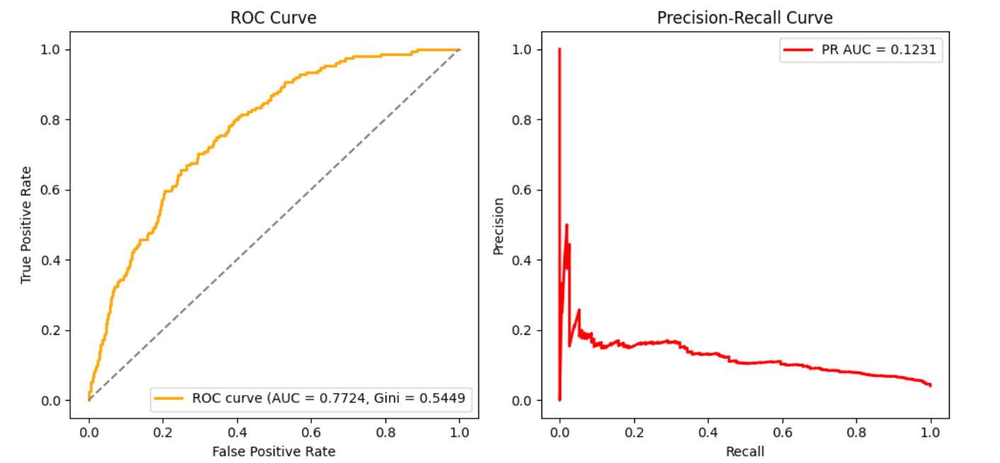
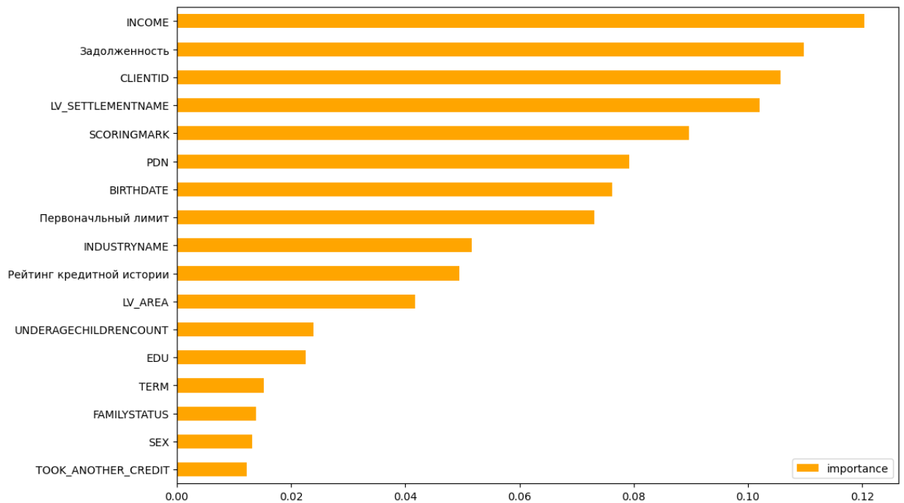

# BNB Data Scientist
My completion of the test task for the position of Data Scientist for BNB

### This project consist of few folders and files:
- **README.md** In this (current) file You read main description of the project: how to use it local on your machine, consistence of the files, methods and etc.
- **kapturov_bnb.ipynb** In this file my code with EDA and model training
- **requirements.txt** In this file I store libraries and version that I used in this project

#### ROC-AUC (0.7724) - the model has a good discriminatory division into classes (default and non-default). The Gini coefficient (0.5449) confirms that the model is significantly better than random guessing.
#### PR-AUC (0.1231) - area under the Precision-Recall request curve, this indicates possible complex models with prediction of random events (defaults).
